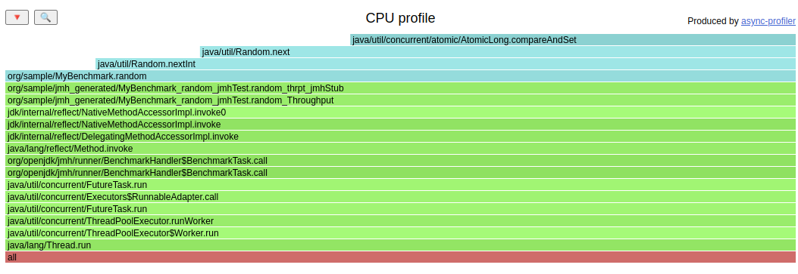
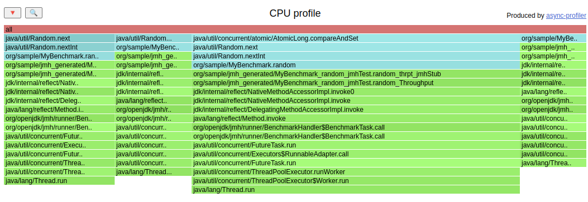
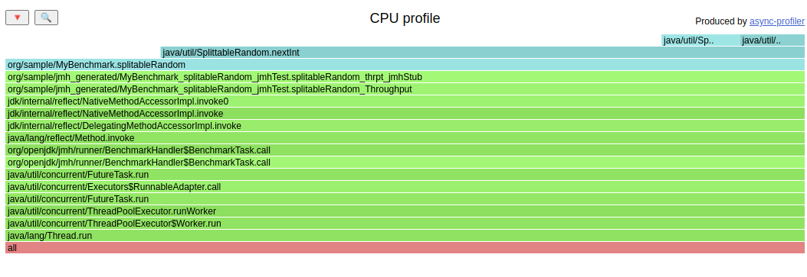
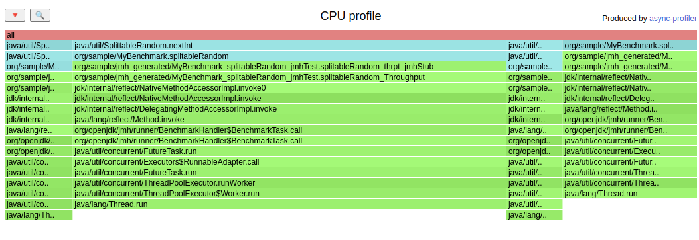

Comparing Random and SplittableRandom for generating a lot of random ints from a single thread


### JMH output
```
# Run complete. Total time: 00:16:42

REMEMBER: The numbers below are just data. To gain reusable insights, you need to follow up on
why the numbers are the way they are. Use profilers (see -prof, -lprof), design factorial
experiments, perform baseline and negative tests that provide experimental control, make sure
the benchmarking environment is safe on JVM/OS/HW level, ask for reviews from the domain experts.
Do not assume the numbers tell you what you want them to tell.

Benchmark                     Mode  Cnt       Score       Error  Units
MyBenchmark.random           thrpt   25  112072.933 ±  6074.700  ops/s
MyBenchmark.splitableRandom  thrpt   25  385761.205 ± 23496.155  ops/s
```

### Flame Graphs

#### java.util.Random




#### java.util.SplittableRandom



